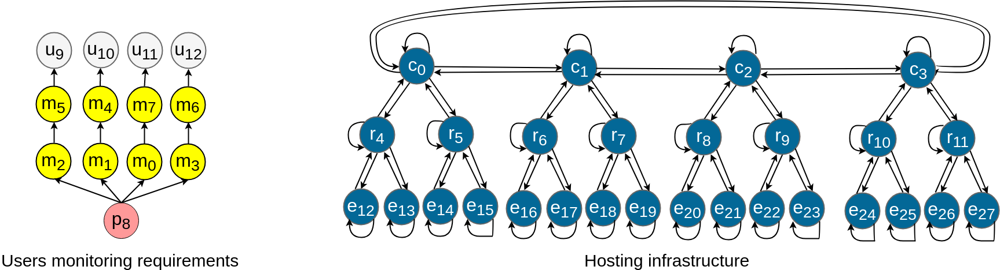

# Placement Calculator
This program calculates a placement of a monitoring service. It gets as input a description of the **users monitoring requirements** in addition to a description of the **hosting infrastructure**. It can calculate a mutualized placement in order to minimize the compute and network footprint of the monitoring service. Please refer to this [paper](https://hal.inria.fr/hal-01897570/document) for the problem statement and the theoretical model.

## Getting Started

The following instructions will get you a copy of the project up and running on your local machine for development and testing purposes.

### Prerequisites
This project has three prerequisites:
- [Git](https://git-scm.com/book/en/v2/Getting-Started-Installing-Git)
- [JDK](https://docs.oracle.com/javase/10/install/installation-jdk-and-jre-linux-platforms.htm#JSJIG-GUID-737A84E4-2EFF-4D38-8E60-3E29D1B884B8)
- [Maven](https://maven.apache.org/install.html)

### Building

To build the Placement Calculator:
```
git clone https://github.com/edgeMonitoring/PlacementCalculator.git
cd PlacementCalculator
mvn package
```

### Running

To lunch the Placement Calculator:
```
mvn exec:exec
```
Once lunched the Placement Calculator asks the user to mention :
-  The placement type : **mutualized** or **non-mutualized**
-  The inputs : the descriptions of the **users monitoring requirements**  and the **hosting infrastructure**. Examples of inputs are available in *PlacementCalculator/src/main/resources*. They are the inputs used in Test UR1 for |U|/|M|=2 in the [paper](https://hal.inria.fr/hal-01897570/document). They are depicted in Figure 1. They are used by default if the user sets no input.
- The number of placements to calculate: **one** or **many**
- The calculation **time limit**

For each found placement, the Placement Calculator returns :
- The time required to calculate the placement.
- The monitoring service compute footprint
- The monitoring service network footprint
- The monitoring service functions and their hosting servers
- The monitoring service flows and their hosting links




